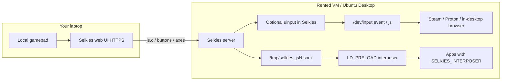

# Optional Selkies uinput gamepad bridge

This addon documents an **optional** path that mirrors Selkies browser gamepad
events to a real kernel Xbox-like controller via `/dev/uinput`.

The default Selkies path remains the [Joystick Interposer](../js-interposer/)
(`LD_PRELOAD`). Use this bridge only when applications need a real
`/dev/input/event*` / `js*` node — notably **Steam / Proton** and browsers
inside the remote desktop (for example [html5gamepad.com](https://html5gamepad.com/)).

## Example use case

You rent a GPU VM on [Vast.ai](https://vast.ai/), pick an **Ubuntu Desktop**
template that streams the session with **Selkies**, open the Selkies UI from
your laptop over HTTPS, and want to play a Steam / Proton game with a local
USB or Bluetooth gamepad.

What you see without this bridge:

1. The Selkies web UI shows the pad as connected (browser Gamepad API works).
2. Native apps that use `LD_PRELOAD` + the Joystick Interposer may still work.
3. **Steam, Proton, and browsers inside the remote desktop do not see any
   controller**, because there is no real kernel `/dev/input` device — only
   Unix sockets for the interposer.

Enable this optional bridge on a Selkies build that includes
`SELKIES_ENABLE_UINPUT_BRIDGE` (see below). After Selkies creates a kernel pad
and you fully restart Steam, the same local gamepad drives games on the rented
desktop.

## How the fix fits together



- **Always available:** browser → Selkies → socket → `LD_PRELOAD` interposer
  (default; works without `/dev/uinput`).
- **Optional (this setting):** Selkies also mirrors the same events to a
  persistent kernel controller so Steam / Proton / remote browsers can
  enumerate it.
- **Also related:** client re-sync + server recreate/associate so pads keep
  working after WebRTC reconnect or page refresh (fixes `jsN is not connected`
  while the UI still shows a pad).

## Why optional?

Selkies intentionally prefers `LD_PRELOAD` so gamepads work in unprivileged
containers without `/dev/uinput` (see historical discussion in
[#95](https://github.com/selkies-project/selkies/pull/95) and
[#168](https://github.com/selkies-project/selkies/issues/168)).
uinput needs device access and is therefore off by default.

## Enable

1. Install `python-evdev` in the Selkies Python environment:
   ```bash
   pip install evdev
   ```
2. Ensure `/dev/uinput` exists and is writable by the Selkies process user
   (often: add the user to the `input` group, or `chmod 666 /dev/uinput` in
   trusted single-user VMs such as a rented Vast.ai desktop).
3. Enable the bridge:
   ```bash
   export SELKIES_ENABLE_UINPUT_BRIDGE=true
   ```
   Or pass `--enable_uinput_bridge=true` if using CLI settings.
4. Restart Selkies. On start, each virtual pad slot may create a kernel device
   named like `Microsoft X-Box 360 pad` / `Selkies Controller`.
5. Connect the Selkies web client over **HTTPS** (or `localhost`), press a
   button on the local pad, then **fully quit and restart Steam** so it
   enumerates the hot-plugged uinput device.

Verify:

```bash
grep -A5 -i 'x-box\|selkies\|microsoft' /proc/bus/input/devices
```

## Out of scope

This path requires a Selkies build that supports
`SELKIES_ENABLE_UINPUT_BRIDGE`. It does **not** cover legacy or external
deployments that only expose `/tmp/selkies_js{0-3}.sock` without that setting
(for example older packaged Selkies on a rented VM where you cannot upgrade
the server). Those setups need a newer Selkies that includes this option.

## Notes

- Does **not** replace `LD_PRELOAD` / `SELKIES_INTERPOSER`.
- Browser Gamepad API requires a [secure context](https://developer.mozilla.org/en-US/docs/Web/API/Gamepad_API)
  (HTTPS or localhost).
- Placeholder regular files at `/dev/input/js*` (created for the interposer)
  can block real kernel `js` nodes; remove non-character placeholders if you
  rely on uinput `js*` devices.
